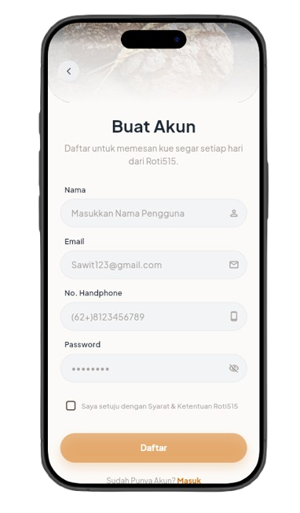
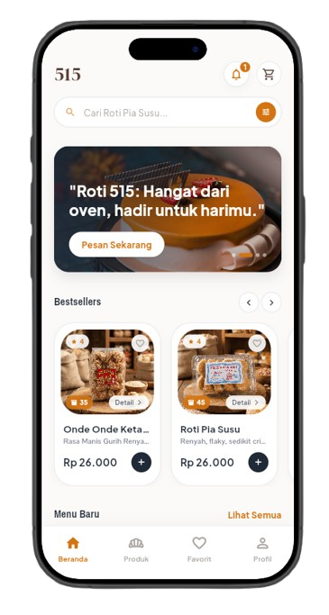
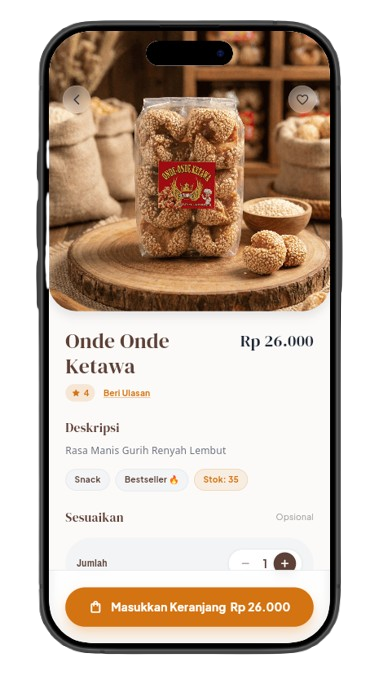
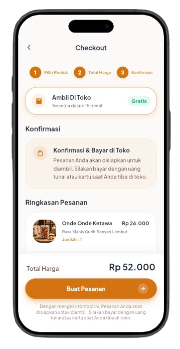
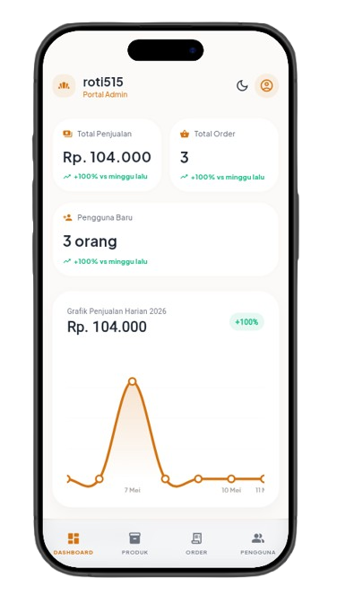
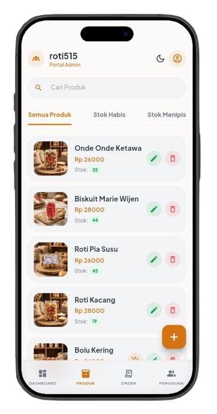

# USER MANUAL: ROTI 515

## 1. Informasi Dokumen
- **Versi:** v1.0.0-Stable
- **Tim Pengembang:** Kelompok Roti 515 (M. Rafi Abiyyuza., Dimas Raditya N., Putra Suis A., Aqilla Nur Aisyah W.)
- **Tahun Pembuatan:** 2026
- **Lingkungan Deploy:** Railway Cloud Infrastructure

---

## 2. Daftar Isi
1. [Pendahuluan](#pendahuluan)
2. [Cara Mengakses Aplikasi](#akses)
3. [Panduan Pengguna (Customer)](#customer)
4. [Panduan Admin](#admin)
5. [Hak Akses Pengguna](#hak-akses)
6. [Alur Sistem](#alur)
7. [Troubleshooting](#trouble)
8. [Informasi Teknis](#teknis)
9. [Penutup](#penutup)

---

## 3. Pendahuluan
Transformasi digital kini menjadi hal yang wajib bagi setiap entitas bisnis, termasuk Usaha Mikro, Kecil, dan Menengah (UMKM), guna memperluas jangkauan dan meningkatkan efisiensi. **Roti 515** hadir sebagai sistem pemesanan roti online yang dirancang khusus untuk memodernisasi interaksi pelanggan dengan produk bakery lokal.

---

## 4. Cara Mengakses Aplikasi
- **Versi Web:** [https://roti515.up.railway.app](https://roti515.up.railway.app)
- **Versi Android:** Instalasi file `Roti515.apk` melalui File Manager.

---

## 5. Panduan Pengguna (Customer)

### 5.1. Cara Login dan Registrasi Akun
1. Buka aplikasi Roti 515. Pilih menu **Login** jika sudah memiliki akun, atau **Daftar** untuk membuat akun baru.
2. Masukkan alamat email dan password Anda, atau lengkapi data diri jika sedang mendaftar.
3. Setelah berhasil masuk, Anda akan diarahkan langsung ke halaman utama (Beranda).

### 5.2. Cara Mencari Produk
1. Di halaman utama, Anda dapat melihat produk-produk unggulan pada bagian Bestsellers.
2. Gunakan fitur pencarian atau gulir pada daftar menu untuk mencari roti atau kue yang diinginkan.
3. Ketuk foto produk untuk melihat detail spesifikasi, deskripsi, dan harga.

### 5.3. Cara Melakukan Pesanan
1. Pada halaman detail produk, tentukan jumlah barang yang ingin dipesan.
2. Anda dapat menambahkan catatan khusus untuk pesanan tersebut jika diperlukan.
3. Tekan tombol **Tambah ke Keranjang** untuk menyimpan pesanan sementara.

### 5.4. Cara Melakukan Checkout
1. Buka menu **Keranjang** (Cart) yang berada di bilah navigasi bawah.
2. Periksa kembali daftar belanjaan Anda.
3. Pilih metode pembayaran dan tentukan jadwal/waktu pengambilan pesanan.
4. Tekan tombol **Checkout** untuk mengonfirmasi transaksi.

### 5.5. Cara Melacak dan Membatalkan Pesanan
1. Buka menu **Riwayat Pesanan** untuk melacak pesanan Anda (contoh: status "Menunggu Pembayaran" atau "Diproses").
2. Untuk **Membatalkan Pesanan**, pilih pesanan yang masih berstatus "Menunggu Pembayaran".
3. Scroll ke bawah pada detail pesanan lalu tekan tombol **Batalkan Pesanan** dan lakukan konfirmasi. Catatan: Pesanan yang sudah diproses tidak dapat dibatalkan.

---

## 6. Panduan Admin

### 6.1. Dashboard Admin
Pantau statistik harian dan ringkasan transaksi.

### 6.2. Manajemen Produk
Admin dapat menambah, mengedit, atau menghapus produk serta memperbarui stok.

---

## 7. Hak Akses Pengguna
| Role | Hak Akses dan Wewenang |
| :--- | :--- |
| **Customer** | Mendaftar, login, katalog, keranjang, checkout, pantau status. |
| **Admin** | Dashboard statistik, manajemen produk & stok, proses transaksi. |

---

## 8. Alur Sistem
**Customer** (Pesan) ➔ **Checkout** (Pilih Jadwal) ➔ **Admin** (Konfirmasi) ➔ **Produksi** ➔ **Siap Diambil** ➔ **Selesai**.

---

## 9. Troubleshooting
| Gejala Masalah | Kemungkinan Penyebab | Langkah Perbaikan |
| :--- | :--- | :--- |
| **Gagal Login** | Email/Password salah | Periksa ketikan atau gunakan Lupa Password. |
| **Gambar Hilang** | Kendala jaringan | Refresh halaman atau bersihkan cache. |
| **Checkout Gagal** | Stok habis tiba-tiba | Periksa stok terbaru di keranjang. |

---

## 10. Informasi Teknis
- **Frontend:** React/Vue (HTML5/CSS3).
- **Backend:** Node.js & Express.
- **Database:** PostgreSQL.
- **Hosting:** Railway Cloud.

---

## 11. Penutup
Roti 515 membantu UMKM bakery bertransformasi menjadi bisnis modern yang efisien. Selamat berbelanja!
