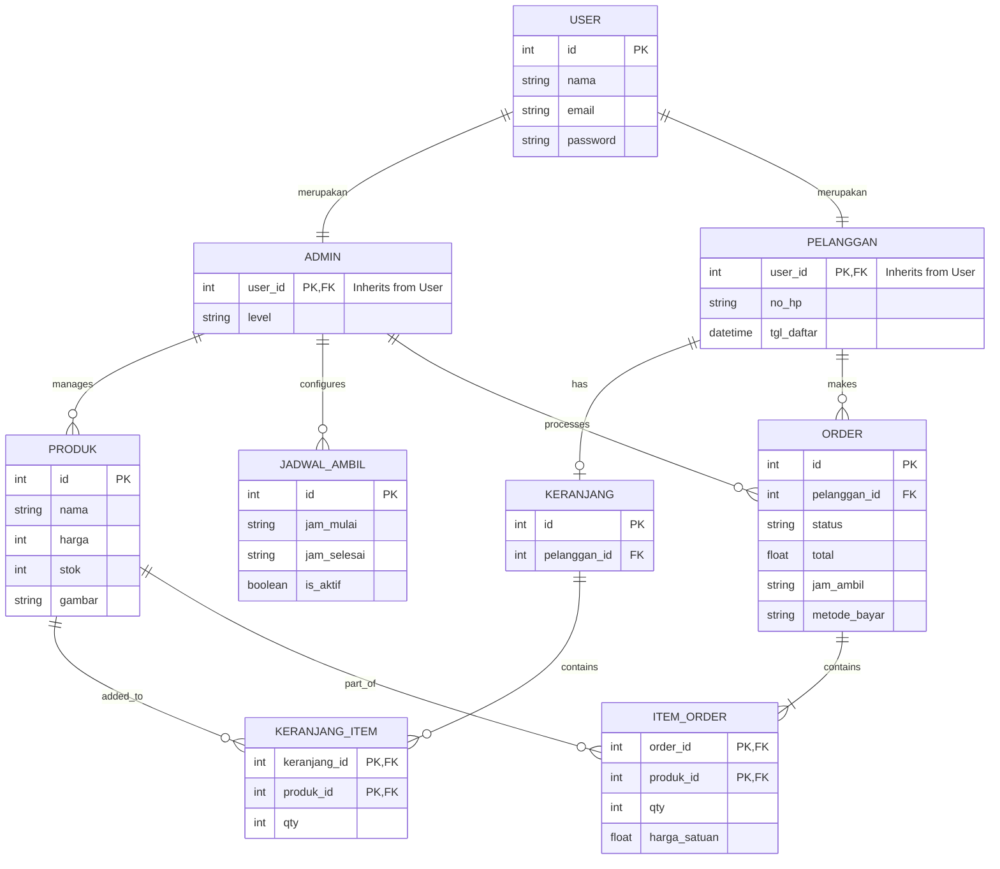

# Conceptual Entity Relationship Diagram (ERD) - Roti 515

Berdasarkan struktur model OOP yang ada di dalam project `lib/core/models/`, berikut adalah bentuk representasi *Entity Relationship Diagram* (ERD) konseptualnya.

### Penjelasan Relasi:
1. **Inheritance (Pewarisan)**: `ADMIN` dan `PELANGGAN` adalah turunan dari `USER`. Mereka memiliki semua atribut dari `USER` ditambah atribut spesifik mereka sendiri.
2. **Pelanggan & Keranjang**: Seorang `PELANGGAN` dapat memiliki 1 `KERANJANG` (One-to-One / One-to-Zero-or-One).
3. **Keranjang & Keranjang Item**: `KERANJANG` dapat berisi banyak `KERANJANG_ITEM` (One-to-Many). `KERANJANG_ITEM` bertindak sebagai *pivot table* yang menghubungkan `KERANJANG` dan `PRODUK`.
4. **Pelanggan & Order**: Seorang `PELANGGAN` dapat membuat banyak `ORDER` (One-to-Many).
5. **Order & Item Order**: Sebuah `ORDER` terdiri dari banyak `ITEM_ORDER` (One-to-Many). Sama seperti keranjang, `ITEM_ORDER` adalah tabel pivot antara `ORDER` dan `PRODUK`.
6. **Admin**: Secara operasional (berdasarkan *method* pada model `Admin`), Admin mengelola `PRODUK`, mengatur `JADWAL_AMBIL`, dan memproses `ORDER`.
